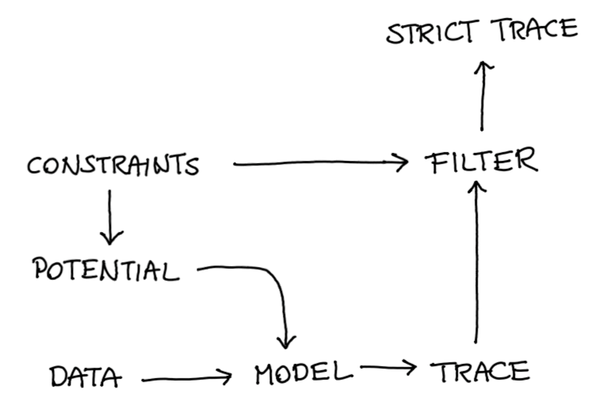

```{r setup, include=FALSE}
knitr::opts_chunk$set(echo = FALSE)
```

<style>
summary{
  background-color: #fbfbfb;
}
details{
  background-color: #fbfbfb;
  padding: 25px;
  padding-bottom: 10px;
  padding-top: 10px;
}
</style> 

The goal of this document is to summarise a lesson we've had in the last year. 
We've done a lot of work on algorithmic bias (and [open-sourced it](https://scikit-lego.readthedocs.io/en/latest/index.html)) and
the main lessons we learned is that constraints are an amazing idea that deserve 
to be used more often in machine learning. This point drove us write the following 
formula on a whiteboard;

$$ \text{model} = \text{data} \times \text{constraints} $$

After writing it down, we noticed that we've seen this before but in a different notation.

$$ p(\theta | D) = p(\text{D} | \theta) p(\theta) $$

It's poetic: maybe ... just maybe ... priors can be interpreted as constraints that we wish 
to impose on models. It is knowledge that we have about how the model *should* work even if
the data wants to push us in another direction. 

So what we'd like to do in this blogpost is explore the idea of constraints a bit more. First
by showcasing how our open source package deals with it but then showing how a probibalistic 
approach might be able to use bayes rule to go an extra mile. 

<aside>This document will contain the summaries, you can find the bigger project [here](https://github.com/MBrouns/this_prior_has_some_potential).</aside>

## Dataset and Fairness 

The dataset we'll be using can be found in [scikit-lego](https://scikit-lego.readthedocs.io/en/latest/index.html). 
It contains traffic arrests in Toronto and it is our job to predict if somebody is released after they
are arrested. It has attributes for skin color, gender, age, employment, citizenship, past interactions and date. 
We consider date, employment and citizenship to be proxies that go into the model while we keep gender,
skin color and age seperate as sensitive attributes that we want to remain fair on. 

Here's a preview of the dataset.

```{r, layout="l-body-outset"}
library(knitr)
kable(head(read.csv("demo.csv")))
```

The dataset is interesting because not only is there a fairness risk; there is also a balancing issue. 
The balancing issue can be dealt with by adding a `class_weight` parameter while the fairness 
can be dealt with in many ways ([exibit A](https://www.youtube.com/watch?v=cIGX-34GwJM), 
[exibit B](https://www.youtube.com/watch?v=Z8MEFI7ZJlA)). A favorable method (we think so) is to apply 
a hard constraint. Our [implementation](https://scikit-lego.readthedocs.io/en/latest/fairness.html#Equal-opportunity) 
of `EqualOpportunityClassifier` does this running a logistic regression constrained by the 
distance to the decision boundary in two groups.

```python
from sklearn.linear_model import LogisticRegression
from sklego.linear_model import EqualOpportunityClassifier

unfair_model = LogisticRegression(class_weight='balanced')
fair_model = EqualOpportunityClassifier(
    covariance_threshold=0.9, # strictness of threshold
    positive_target='Yes',    # name of the preferable label
    sensitive_cols=[0, 1, 2]  # columns in X that are considered sensitive
)

unfair_model.fit(X, y)
fair_model.fit(X, y)
```

<details>
  <summary><b>Details on the Methods.</b></summary>


Logstic Regression works by optimising the log likelihood.

$$
\begin{array}{cl}{\operatorname{minimize}} & -\sum_{i=1}^{N} \log p\left(y_{i} | \mathbf{x}_{i},
        \boldsymbol{\theta}\right) \\\end{array}
$$

But what if we add constraints here? That's what the `EqualOpportunityClassifier` does. 

$$
\begin{array}{cl}{\operatorname{minimize}} & -\sum_{i=1}^{N} \log p\left(y_{i} | \mathbf{x}_{i},
        \boldsymbol{\theta}\right) \\
        {\text { subject to }} & {\frac{1}{POS} \sum_{i=1}^{POS}\left(\mathbf{z}_{i}-\overline{\mathbf{z}}\right) d
        \boldsymbol{\theta}\left(\mathbf{x}_{i}\right) \leq \mathbf{c}} \\
        {} & {\frac{1}{POS} \sum_{i=1}^{POS}\left(\mathbf{z}_{i}-\overline{\mathbf{z}}\right)
        d_{\boldsymbol{\theta}}\left(\mathbf{x}_{i}\right) \geq-\mathbf{c}}\end{array}
$$

It minimizes the log loss while constraining the correlation between the specified `sensitive_cols` and the distance to the decision boundary of the classifier for those examples that have a `y_true` of 1.

See [documentation](https://scikit-lego.readthedocs.io/en/latest/fairness.html#Equal-opportunity).
</details>

## Results 

The main difference between the two approaches is that in the Logistic Regression 
scheme we drop the sensitive columns while the other approach actively corrects for 
them. The table below shows the cross-validated summary of the mean test performance 
of both models.

```{r, layout="l-body-outset"}
library(knitr)
kable(head(read.csv("stats.csv")))
```

<details>
  <summary><b>Details on Equal Opportunity Score.</b></summary>
  One way of measuring fairness could be to measure equal opportunity, which is abbreviated above as **eqo**. 
  The idea is that we have a sensity attribute, say race, for which we don't want unfairness with regards to
  the positive outcome $y = 1$. Then equal opportunity is defined as follows; 
  
  $$ \text{equality of opportunity} = \min \left(\frac{P(\hat{y}=1 | z=1, y=1)}{P(\hat{y}=1 | z=0, y=1)}, \frac{P(\hat{y}=1 | z=0, y=1)}{P(\hat{y}=1 | z=1, y=1)}\right) $$
  Extra details can be found [here](https://scikit-lego.readthedocs.io/en/latest/fairness.html#Measuring-fairness-for-Classification).
</details>

<br>

You can also confirm the difference between the two models by looking at their 
coefficients.

```{r, layout="l-body-outset"}
library(knitr)
kable(head(read.csv("coefs.csv")))
```

There are a few things to note at this stage; 

- The more fair model seems to shift the intercept drastically but the other
columns (which are normalised) less so. 
- The more fair is arguably still useful despite having a lower precision. It
compensates with fairness but also with recall. 
- Having a fairness constraint based on distance to the decision boundary is one 
description of fairness. There are many other measures of fairness and we're only using this particular one because it offers us a convex algorithm that can give us guarantees
on the training data.
It would be nice to have the opportunity to define more flexible definitions of 
fairness.
- The current modelling approach allows us to make predictions but these 
predictions do not have uncertainty bounds. 
- Linear models are fine, but sometimes we may want to apply 
constraints to hierarchical models. 

## Probibalistic Programming

This brings us back to the formulae that we started with. 

$$ \text{model} = \text{data} \times \text{constraints} $$

In our case the constraints we want concern fairness.

 $$ p(\theta | D) \propto \underbrace{p(D | \theta)}_{\text{data}} \underbrace{p(\theta)}_{\text{fairness?}} $$

So can we come up with a prior for that? 

To explore this idea we set out to reproduce our results from earlier in PyMC3. We started with an
implementation of logistic regression but found that it did not match our earlier results.
The results of the trace are listed below. We show the distribution of the weights as well as a 
distribution over the unfairness which is defined like so; 

```python
mu_diff = pm.Deterministic('mu_diff', dist_colour.mean() - dist_non_colour.mean())
```

<details>
  <summary><b>PyMC3 Implementation.</b></summary>
```python
with pm.Model() as unbalanced_model:
  intercept = pm.Normal('intercept', 0, 1)
  weights = pm.Normal('weights', 0, 1, shape=X.shape[1])

  p = pm.math.sigmoid(intercept + pm.math.dot(X, weights))
  
  dist_colour = intercept + pm.math.dot(X_colour, weights)
  dist_non_colour = intercept + pm.math.dot(X_non_colour, weights)
  diff = dist_colour.mean() - dist_non_colour.mean()
  mu_diff = pm.Deterministic('mu_diff', diff)

  pm.Bernoulli('released', p, observed=df['released'])

  unbalanced_trace = pm.sample(tune=1000, draws=1000, chains=6)
```
</details>


```{r, out.width = '100%', fig.cap="Standard Logistic Regression in PyMC3."}
imgs <- c("pymc-1.png")
knitr::include_graphics(imgs)
```

This was because our original logistic regression had a `balanced` setting. Luckily for us
PyMC3 has a feature to address this; `pm.Potential`. 

## `pm.Potential` 

The idea behind the potential is that you add a prior on a combination
of parameters instead of just having it on a single one. For example, this
is how you'd usually set parameters; 

```python
mu    = pm.Normal('mu', 0, 1)
sigma = pm.HalfNormal('sigma', 0, 1)
```

By setting the `sigma` prior to be `HalfNormal` we prevent it from ever 
becoming negative. But what if we'd like to set another prior, namely
that $\mu \approx \sigma$? This is what `pm.Potential` can be used for. 

```python
pm.Potential('balance', pm.Normal.dist(0, 0.1).logp(mu - sigma))
```

Adding a potential has an effect on the likelihood of a tracepoint.

```{r, out.width = '100%', fig.cap="Example of a tracepoint that is both less (left) and more likely (right) given the potential."}

```

This in turn will make the posterior look different. 

```{r, out.width = '100%', fig.cap="The effect that the potential might have."}

```

## Back to Logistic Regression 

So we made a second version of the logistic regression. 

<details>
  <summary><b>PyMC3 Implementation.</b></summary>
```python
with pm.Model() as balanced_model:
    intercept = pm.Normal('intercept', 0, 1)
    weights = pm.Normal('weights', 0, 1, shape=X.shape[1])

    p = pm.math.sigmoid(intercept + pm.math.dot(X, weights))
    
    dist_colour = intercept + pm.math.dot(X_colour, weights)
    dist_non_colour = intercept + pm.math.dot(X_non_colour, weights)
    diff = dist_colour.mean() - dist_non_colour.mean()
    mu_diff = pm.Deterministic('mu_diff', diff)
    balance = pm.Bernoulli.dist(p).logp(df['released'].values)
    pm.Potential('balance', sample_weights.values * balance)


    balanced_trace = pm.sample(tune=1000, draws=1000, chains=6)
```

Note the new formulation of the likelihood of our observed data. Where before we used the `pm.Bernoulli` directly, now  we use its `.dist` attribute inside a `pm.Potential` object

</details>

These results were in line with our previous result again. 


But that `pm.Potential` can also be used for other things! 
Suppose we have our original trace that generates our posterior. 

```{r, out.width = '100%', fig.cap="From trace to posterior."}

```

Now also suppose that we have a function that describes our potential. 

```{r, out.width = '100%', fig.cap="Two belief systems ... "}

```

Then these two can be combined! Our prior can span beyond a single parameter
it can influence the entire posterior.

```{r, out.width = '100%', fig.cap="Two belief systems ... merged!"}

```

So we've come up with a potential for fairness. 

``` python
X_colour, X_non_colour = split_groups(X, key="colour")
...
dist_colour = intercept + pm.math.dot(X_colour, weights)
dist_non_colour = intercept + pm.math.dot(X_non_colour, weights)
mu_diff = pm.Deterministic('mu_diff', dist_colour.mean() - dist_non_colour.mean())
pm.Potential('dist', pm.Normal.dist(0, 0.01).logp(mu_diff))
```

Note that in this code the `0.01` value on the bottom line. This value can
be interpreted as strictness for fairness. The lower it is, the less wiggle
room the sampler has to explore areas that are not fair.

The results can be seen below.

<details>
  <summary><b>PyMC3 Implementation.</b></summary>
```python
with pm.Model() as dem_par_model:
    intercept = pm.Normal('intercept', 0, 1)
    weights = pm.Normal('weights', 0, 1, shape=X.shape[1])

    p = pm.math.sigmoid(intercept + pm.math.dot(X, weights))

    dist_colour = intercept + pm.math.dot(X_colour, weights)
    dist_non_colour = intercept + pm.math.dot(X_non_colour, weights)
    diff = dist_colour.mean() - dist_non_colour.mean()
    mu_diff = pm.Deterministic('mu_diff', diff)

    pm.Potential('dist', pm.Normal.dist(0, 0.01).logp(mu_diff))
    balance = pm.Bernoulli.dist(p).logp(df['released'].values
    pm.Potential('balance', sample_weights.values * balance))

    dem_par_trace = pm.sample(tune=1000, draws=1000, chains=6)
```
</details>

```{r, out.width = '100%', fig.cap="Potential Fairness in PyMC3."}
imgs <- c("pymc-3.png")
knitr::include_graphics(imgs)
```

## Still a problem 

There's still an issue. We've gotten a flexible approach here. Compare to the 
scikit approach we can have more flexible definitions of fairness and we can 
have more flexible models (hierarchical models, non-linear models) but at the moment
our models does not **guarantee** fairness. 

Even though the prior on the difference between the groups is set to a very narrow distribution around zero, there is still some probability mass far away from zero. We tried putting a uniform prior on the distance between the two groups to get rid of that probability mass, but this makes it nearly impossible for a sampler to explore the posterior space.

But then Matthijs came up with a neat little hack. 

```{r, out.width = '100%', fig.cap="Posterior Belief and Potential Direction"}

```

We use our potential to push samples in a direction. This push *must* be continous 
if we want gradients to help ous out here. But after this push is done, we would 
we would like to make a hard cutoff on our fairness. So why don't we just filter 
out the sampled points that we don't like? 

```{r, out.width = '100%', fig.cap="After the data is pushed we do a hard filter."}
knitr::include_graphics("drawing7.png")
```

This way, we still get a distribution out but this distribution is guaranteed to never
assign any probability mass in regions where we deem the predictions to be 'unfair'. 

<details>
  <summary><b>PyMC3 Implementation.</b></summary>
```python
def trace_filter(trace, param, threshold_val):
    """
    Filters a PyMC multitrace to remove all samples 
    where param is greater than threshold  value
    """
    mask = np.abs(trace[param']) < threshold_val
    print(f"starting trace length: {len(trace[param])}")
    print(f'remainder: {mask.sum()}')
    strace = trace._straces[0]
    new_strace = pm.backends.NDArray(model=strace.model, vars=strace.vars)
    
    samples = {varname: trace[varname][mask] for varname in trace.varnames}
    new_strace.samples = samples
    new_strace.draws = mask.sum()
    new_strace.draw_idx = mask.sum()
    new_strace.chain = 0
    return pm.backends.base.MultiTrace([new_strace])
    
    
def hard_constraint_model(df):
    def predict(trace, df):
        X = df[['year', 'employed', 'citizen', 'checks']].values
        regr = trace['intercept'][:, None] + trace['weights'] @ X.T
        return expit(regr.mean(axis=0))
    
    X = df[['year', 'employed', 'citizen', 'checks']].values
    X_colour, X_non_colour = X[df['colour'] == 1], X[df['colour'] == 0] 

    
    class_weights = len(df) / df['released'].value_counts()
    sample_weights = df['released'].map(class_weights)
    with pm.Model() as dem_par_model:
        intercept = pm.Normal('intercept', 0, 1)
        weights = pm.Normal('weights', 0, 1, shape=X.shape[1])

        p = pm.math.sigmoid(intercept + pm.math.dot(X, weights))

        dist_colour = intercept + pm.math.dot(X_colour, weights)
        dist_non_colour = intercept + pm.math.dot(X_non_colour, weights)
        diff = dist_colour.mean() - dist_non_colour.mean()
        mu_diff = pm.Deterministic('mu_diff', diff)

        pm.Potential('dist', pm.Normal.dist(0, 0.01).logp(mu_diff))
        balance = pm.Bernoulli.dist(p).logp(df['released'].values)
        pm.Potential('balance', sample_weights.values * balance)

        dem_par_trace = pm.sample(tune=1000, draws=1000, chains=6)
    return trace_filter(dem_par_trace, 0.16), predict
```
</details>

Note that in the results, the fairness metric has a hard cutoff. 

```{r, out.width = '100%', fig.cap="Enforce Fairness in PyMC3."}
imgs <- c("pymc-4.png")
knitr::include_graphics(imgs)
```

The approach that we propose here is relatively generic. You can make
hierarchical models and you have more flexiblity in your definition of 
fairness. You start with constraints which you need to translate into
a potential after which you can apply a strict filter.

```{r, out.width = '100%', fig.cap="The general recipe."}

```

We've just come up with an approach where our potential represents fairness.
Since we filter the trace afterwards we have an algorithm with properties we
like. We don't want to suggest this approach is perfect though, so here's some
valid points of critique;

- This approach **does not guarantee fairness**. We've merely guaranteed fairness
on a single definition and only on our training set. This approach has merit 
to it but we should not presume that it will be enough. The dataset that we see
in production might drift away from what we see in training and there may certainly
be facets of fairness that may be hard to capture with a potential. 
- This approach will fail in settings where the model has so many hyperparameters 
that we can't create a potential with domain knowledge. Neural networks for image
detection may still be out of scope for this trick. 
- Sampler-based approaches don't get stuck in local optima as often as gradient 
approaches but even NUTS can get stuck. We also can't say for sure when the trace
has enough samples to be reliable. The training procedure is also very expensive.

## Conclusion

We're pretty exited about this way of thinking about models. The reason why is 
best described with an analogy in fashion and is summerised in this photo;

```{r, out.width = '100%', fig.cap="This is what `OneSizeForAll().fit()` looks like. It never fits perfectly."}
imgs <- c("fashion.png")
knitr::include_graphics(imgs)
```

We think [scikit-learn](scikit-learn.org) is an amazing tool. It sparked the 
familiar `.fit()`/`.predict()` interface that the ecosystem has grown accostomed to
and it introduced a wonderful concept via its `Pipeline`-API. But all this greatness
comes at a cost; people seem to be getting lazy. 

Every problem get's reduced to something that can be put into a `.fit()`/`.predict()` 
pipeline. The clearest examples of this can be found on the kaggle platform. 
Kaggle competitions are won by reducing a problem to a single metric, optimising it
religiously and not worrying about the application. They're not won by understanding 
the problem, modelling towards it or by wondering how the algorithm might have 
side-effects that you don't want.

It is exactly on this axis that this approach gives us hope. Instead of calling
`model.fit()` you get to enact `tailer.model()` because you're forced to think
in constraints. This means that we **actually** get to model again! We can add 
common sense as a friggin' prior! How amazing is that!

### Dream a Little

To add a cherry on top; in our example we're using fairness as a driving argument 
but the reason to be exited goes beyond that. 

- Maybe you are predicting a timeseries but you want to prevent *at all times*
that the prediction out of the model ever yields a negative value. 
- Maybe you are building a recommender for netflix and you want to add a 
prior that punishes popular content such that the viewers
don't get stuck in a filter bubble and enjoy more diverse content. 
- Maybe you are a researcher in healthcare and want to insure yourself 
against Simpsons paradox. One way of guarding yourself against this is by 
adding a prior that states that *in all cases* smoking is bad for your
health. Even when an outlier suggests otherwise. 

The act of thinking constraints immediately makes you seriously consider the problem 
before modelling and that ... that's got a lot of potential. 